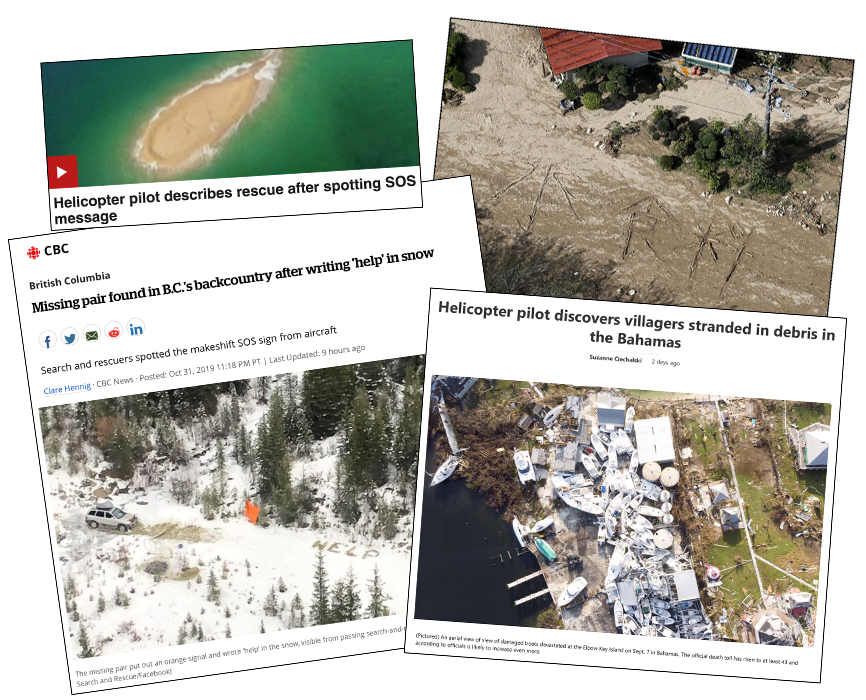
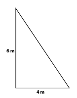
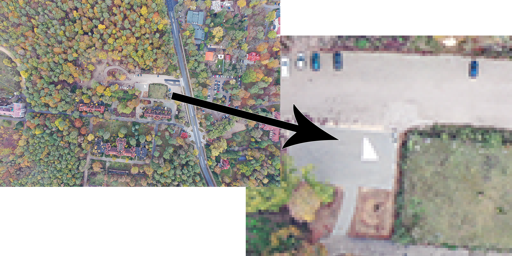

# SVESADS

### Simple Visual Emergency Signal for Automated Detection from Space

&nbsp;

> This will probably turn into a paper of some sort sooner or later, but at present it's just a way for me to document the project and for other people that want to help to get up to speed quickly...

&nbsp;

Natural disasters can be awe-inspiring. I guess it's different for everyone, but no natural disaster impresses me more than a hurricane. The sheer size of the destruction, the flattened houses, the flooding. People with no roof over their head, no access to water or food, power and communications cut off, sometimes for weeks.

Followed some time after by rescue workers looking through the rubble for people that had stayed behind and now need help.

As I was following the aftermath of hurricane Dorian recently, rescue workers were again frantically searching a relatively wide area (in the Bahamas this time) for survivors. It seemed to be a painstaking process, searching from the ground as well as from helicopters and planes.

If and when there is enough help available (a big if in some cases), people in cities and denser towns can find help or at least make their presence known simply because there are more people around them. It's the people in rural and other more sparsely populated areas whose lives are more likely to depend on the aility to signal for help. 

And then there's the situations where people may be searching for a single group or invidual, lost in what may be a very large area. As seen above, people have survived because of makeshift signals, seen from low-flying aircraft or helicopters. Such signals can be seen from a few kilometers distance and are certainly a large step up from having to search the area on the surface. But when the search area is very large, even the ability to search from the low-flying aircraft still doesn't quite cut it. (See below)

While the rescue efforts during the aftermath of hurricane Dorian were in progress, I was browsing the web and at some point looking at satellite images of the impacted area. It struck me that when disaster strikes, we now apparently have color images at 70 cm or even 50 cm resolution, taken multiple times a day. And then it hit me: wouldn't it be amazing if survivors below could somehow signal via these images that they needed help? With regular images like we seem to have now, we would have a way to find isolated people that need help in an area the size of a whole country.

&nbsp;

## The signal

So what we're looking for is a way to signal that help is needed, to be seen on satellite images. Here's some thoughts on this signal, in no particular order and with no guarantee that these all hold true.

* Very regularly taken (multiple times a day in some cases) satellite images seem to be available for disaster areas, presently at a resolution where each pixel represents 70cm x 70cm (27" x 27") on the ground. While this is seen as a fairly high resolution for civilian satellite imagery, it is still a fairly problematic resolution for signalling something unique.

* The space the suvivor has to make this signal may be as little as a roof in a flooded area, so let's say that is on the order of 7 x 7 meters. That means that optimally, the signal has to be recognisable at as little as 10x10 pixels.

* Ideally survivors would be able to create the signal from a wide range of materials that might be available to them.

* Survivors will probable not have available materials in various colors, and satellite images may not be color-corrected and taken at differing times of day and in various reflective circumstances. A monochrome signal that simply has to contrast with the environment might make most sense. 

* When it comes to recognising a low-resolution image of a very basic shape, there will unavoidably be false positives. Some large fraction of these will be features of buildings and or landscape that were also present pre-disaster. If pre-disaster images are available, one would expect many of these false positives can be excluded.
 
&nbsp;

## Experimenting: the triangle

I decided to experiment with a very simple shape at the minimal size I though might be automatically detectable. A rectangle is what seems easiest since most materials people would have on hand are rectangular (bed sheets, plastic tarp, etc). But looking at aerial images, it seems there are many rectangles in any built-up environment that would become false positives. So I decided to fold the net over to make a triangle as follows:

To play with the idea, I scaled a Google earth image so that each pixel would be 70 x 70 cm. I then added the triangle shape in Photoshop, so that it would appear on my roof.

The resulting [image](images/whereswaldo.png) is rather large, so we're not showing it inline here. My friend Sascha then ran a very simple [script](files/whereswaldo.py) using python and [opencv](https://pypi.org/project/opencv-python/) to see if he could find the triangle. Turns out that works but as soon as one even slightly relaxes the criteria for the triangle, a lot of false positives happen. (His script works best on a [portion](images/whereswaldo_selected.png) of the image, because otherwise each cycle of testing takes too long.)

This attempt to find shapes is overly simplistic, and can probably be optimised much further using more sophisticated computer vision techniques, more advanced assumptions about the angles in the triangle and machine learning. On the other hand, the script is already cheating a bit by taking out anything that's below a certain lightness, which may not be a realistic assumption. Also the white triangle in this test wasn't actually photographed but photoshopped in; it's center pixels are all exactly the same color.

I decided I needed to look at actual aerial images. So I bought a 4 x 6 meter [white camouflage net](https://www.amazon.de/gp/product/B073H48DRR), got a drone and took some aerial photos of my net folded into a triangle such as this one:

(Here's the [original image](images/drone-triangle-orig.jpg) and the one [scaled down](images/drone-triangle-70cm.png) to 70 cm pixels.)

&nbsp;

## H for help

Even without trying to detect the triangle in software but just from looking at various aerial images, it's clear the triangle is probably too simple: there's simply too damn many triangles appearing in the wild. So this needs a more complex shape, yet one that is still simple enough to show itself when scaled down to something like 10x10 pixels and simple enough to be remembered and made by people in distress with whatever materials they have at hand. Behold the second experiment: "H for help"

&nbsp;

## Synthetic training data

It looks likely that finding noisy, perspectively shifted, lo-res and otherwise mutilated copies of these signals in large sets of aerial images is a job for AI, machine learning, neural networks or whatever you want to call it. I knew very little beyond the basics here, but what I did know is that any use of Machine Learning / AI will require tons of training data: many images that contain different varieties of the signal. 

There's only so many times you can make large H shapes on the ground and fly a drone or order aerial imagery, so what is needed is synthetic training data. That means software that takes the basic shape and randomly rotates, perpectively shifts, colors, and puts noise on it. It then looks at the aerial image and finds a "quiet spot" to put that shape and blends it with the image so that the edge pixels correctly dither from the signal color to the background. My python program sigsim does it all. The [README](files/sigsim/README.md) in the sigsim directory explains how it works in case you want to create your own synthetic training data.

&nbsp;

## Case in point: Alice Springs 

### [Second person found alive in Northern Territory after two weeks missing in the outback](https://www.theguardian.com/australia-news/2019/dec/04/police-locate-body-near-alice-springs-believed-to-be-that-of-missing-woman-claire-hockridge) &nbsp;&nbsp;&nbsp;&nbsp;[archive](images/missing.pdf)

Just as I was working on this, in November/December 2019, three people went missing for almost two weeks after their car got stuck in the outback south of Alice Springs, Australia. They split up and the area where they could be was massive: the two survivors were found more than 60 km apart, the third person was found dead. They had to take cover from the sun in the daytime, so they could not be spotted from the air unless the search plane was low enough that they could hear it.

Now to be sure: if you're going to risk getting in trouble in the middle of nowhere, please get a [COSPAS/SARSAT Personal Locator Beacon](https://en.wikipedia.org/wiki/Emergency_position-indicating_radiobeacon_station). Size of a pack of cigarettes, costs around 200 euros one-time fee, press button anywhere on earth and get help. 

**But am I crazy in thinking that when you're looking for people that _don't_ have a PLB, looking for an internationally standardized 6 x 6 meter symbol to be improvised on the ground which can be found by software on today's rapidly tasked commercial satellite images is still lightyears better than flying at low altitude while searching a massive area? Even if you do both: tasking imagery is likely much cheaper than flying helicopters and planes.**
