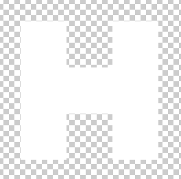
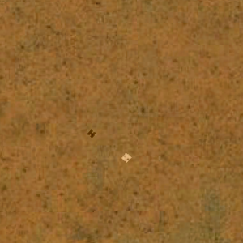

# sigsim

### Overlaying aerial images with signals to train ML / AI for SVESADS project

&nbsp;

sigsim is a python script that uses the OpenCV library to realistically overlay scaled-down and perspectively shifted versions of a given signal shape onto aerial images. It has subcommands to crop images, cut them into many smaller images, and to do the actual overlaying of the signal image. 

&nbsp;

## Installation

First you need python3 installed. I have included the installation instructions for MacOS below, but instructions for Linux or Windows should be similar enough.

1. Install python, e.g. from [python.org](https://www.python.org/downloads/)

2. Install the prerequisites, if you don't have them already: `pip3 install opencv-python numpy`

3. Change the location of the python executable ( `which python3` ) in the first line of the `sigsim` script.

4. Make sigsim executable: `chmod a+x sigsim` 

5. Run the script in debug mode to generate a version of the signal, just to see if it's working:

  `./sigsim debug --resolution 70 --shape H.png` 

  >(You should now get two small overlapping windows that show the shape of the H and the shape of the mask that will be used to see if the landing area for the H is clear enough (more about that later).
  
6. click in one of the windows and hit any key to stop the script: it's all working...


&nbsp;

## The shape

As seen above, the shape of the signal is in the file you specify with '--shape'. This file is an image with only white and transparent pixels, with each pixel representing 1 x 1 cm on the ground. So the image of the 'H' would look like this in Photoshop:



(With the longest sides of the H measuring 600 pixels for 6 meters on the ground)


&nbsp;

## Aerial images

I got my test images for the first tests from the easiest source: Google Earth. To obtain them, I did the following:

1. Figure out what resolution you want to emulate. Commercial satellite imagery is avaiable at 50 and 70 cm per pixel, so those seem good resolutions to play with.

2. Set Google Earth to full screen, turn off all the map layers (roads, terrain, borders, etc) and turn off the sidebar

3. Find the number of pixels on your screen. My screen has 6720 x 3780 pixels. Use the ruler to create a line that is as long as the width of your screen would be on the ground in the desired resolution.
	* So if I select 70 cm resolution, my screen would show an area that is 70 cm times 6720 pixels = 4704 meters.
	
4. Zoom until the line is exactly the width of the screen and turn off the ruler

5. Take a screenshot (Cmd-Shift-3 on the Mac)

6. Drag the window somewhere else (without zooming) to take more screenshots.

7. Use the sigsim 'crop' subcommand to cut the Google Earth stuff off the image. On my screen, that means

	`./sigsim crop -i <screenshot> -o <imagefile> -w 6545 -h 3417 -x 0 -y 54`
	
8. You now have images that at least emulate satellite images in the desired resolution.


&nbsp;

## Caffe - Deep Learning Framework

My friend Leif knows actually knows things about the magic of Deep Learning and has played with the [Caffe Framework](https://caffe.berkeleyvision.org/). So we'll try to use it for recognising our signal in the images. Their training precedure seems to prefer lots of small images, so before we superimpose our signal onto these images, we cut them into 300x300 pixel squares. This uses another feature of sigsim, which chops the larger aerial images into many smaller ones:

`mkdir chops; ./sigsim chop -i <image> -o chops/RANDOM.png -w 300 -h 300`

> Note that the RANDOM in all caps in the output file gets replaced by a different random hex string of 8 characters for each 300 x 300 pixel fragment.

Now you have a directory full of 300x300 pixel aerial images in the right resolution.


&nbsp;

## Marking the images

the 'mark' subcommand of sigsim will superimpose the marks on the image. The script below will add between 2 and 5 marks on each image and write the superimposed images as well as the metadata files that CAFFE wants to the output directory.

```
mkdir marked
for i in `ls chops`
	do ./sigsim mark -i chops/$i -o marked/$i --res 70 --shape H.png --random 2-5
done
```

This would produce output images like this:



The metadate files are very simple, they are names the filename of the image with '.xml' appended and they simply contain the locations for the marks. Here's an example for an image with two marks:

```
<annotation>
  <size>
    <width>300</width>
    <height>300</height>
  </size>
  <object>
    <name>signal</name>
    <difficult>0</difficult>
    <bndbox>
      <xmin>0</xmin>
      <ymin>26</ymin>
      <xmax>20</xmax>
      <ymax>46</ymax>
    </bndbox>
  </object>
  <object>
    <name>signal</name>
    <difficult>0</difficult>
    <bndbox>
      <xmin>192</xmin>
      <ymin>59</ymin>
      <xmax>209</xmax>
      <ymax>75</ymax>
    </bndbox>
  </object>
</annotation>
```

